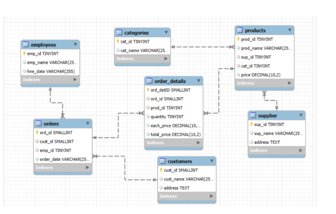
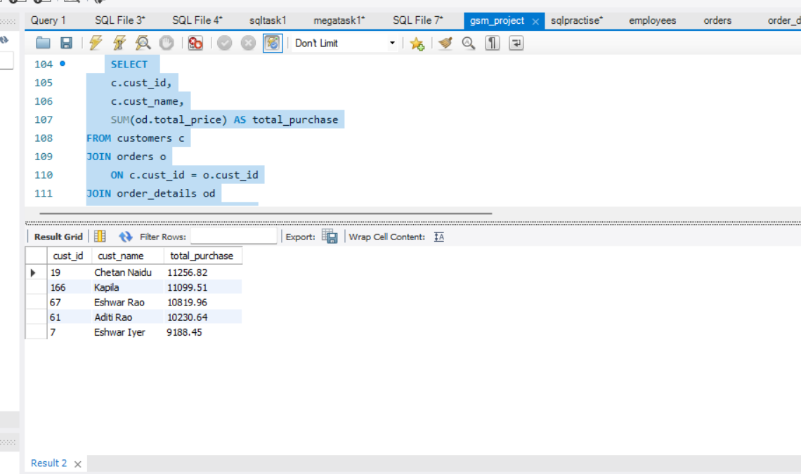

# GSM SQL Data Analysis Project

## 📌 Project Overview

This project focuses on analyzing a GSM (General Store Management) database using MySQL.

The database contains information about customers, products, suppliers, categories, employees, orders, and order details. SQL queries are used to extract meaningful insights related to customer behavior, product performance, sales, suppliers, and employee performance.

## 🎯 Project Objectives

- Analyze customer purchasing behavior
- Evaluate product performance
- Analyze sales and order trends
- Understand supplier contribution
- Analyze employee order performance
- Explore order details and pricing patterns

## 🗄️ Database Structure

The database contains 7 tables:

- **Customers**
- **Products**
- **Categories**
- **Suppliers**
- **Employees**
- **Orders**
- **Order Details**

The database uses primary keys and foreign keys to establish relationships between the tables.

### Entity Relationship Diagram

## 📊 Analysis Performed

### 👥 Customer Insights

- Number of unique customers who placed orders
- Customers with the highest number of orders
- Total and average purchase value per customer
- Top 5 customers by total purchase amount

### 🛍️ Product Performance

- Number of products in each category
- Average product price by category
- Products with the highest sales quantity
- Total revenue generated by each product
- Product sales by category and supplier

### 📈 Sales & Order Trends

- Total number of orders
- Average order value
- Dates with the highest number of orders
- Monthly order volume and revenue
- Weekday vs weekend order patterns

### 🚚 Supplier Contribution

- Total number of suppliers
- Supplier providing the most products
- Average product price by supplier
- Supplier contribution to total sales revenue

### 👨‍💼 Employee Performance

- Number of employees who processed orders
- Employees handling the most orders
- Total sales processed by each employee
- Average order value handled by each employee

### 📦 Order Details Analysis

- Relationship between quantity ordered and total price
- Average quantity ordered per product
- Minimum, maximum, and average unit price across products and orders

## 🔍 Sample Analysis

### Top Customers by Total Purchase

### Products with Highest Quantity Sold

.png)

## 🛠️ Tools & Technologies

- **MySQL**
- **MySQL Workbench**
- **SQL**

## 📚 SQL Concepts Used

- SELECT
- WHERE
- GROUP BY
- HAVING
- ORDER BY
- LIMIT
- Aggregate Functions
- INNER JOIN
- Subqueries
- CASE Statements
- Date Functions
- Primary Keys
- Foreign Keys
- Database Relationships

## 📁 Project Files

- `gsm_project.sql` – Database creation, table definitions, relationships, and SQL analysis queries
- CSV files – Project datasets
- Database ER diagram – Visual representation of table relationships
- Analysis screenshots – Examples of SQL queries and results

## 👨‍💻 Author

**Varun Kumar Reddy**

B.Tech – Computer Science & Engineering

Aspiring Data Analyst
